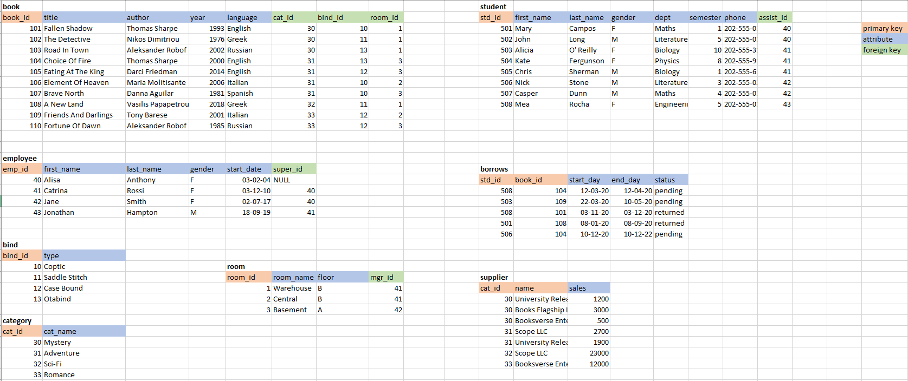

# Library
  
This is a simple project that tries to represent how data is organized in a university library. The relationship and cardinality between all the entities involved are defined precisely using an ER diagram. After creating the database schema and insert the data, I set some problems that try to answer by writing specific SQL queries. 

The tools used are: VScode, MySQL server as the RDBMS and the SQL language.

Database schema

